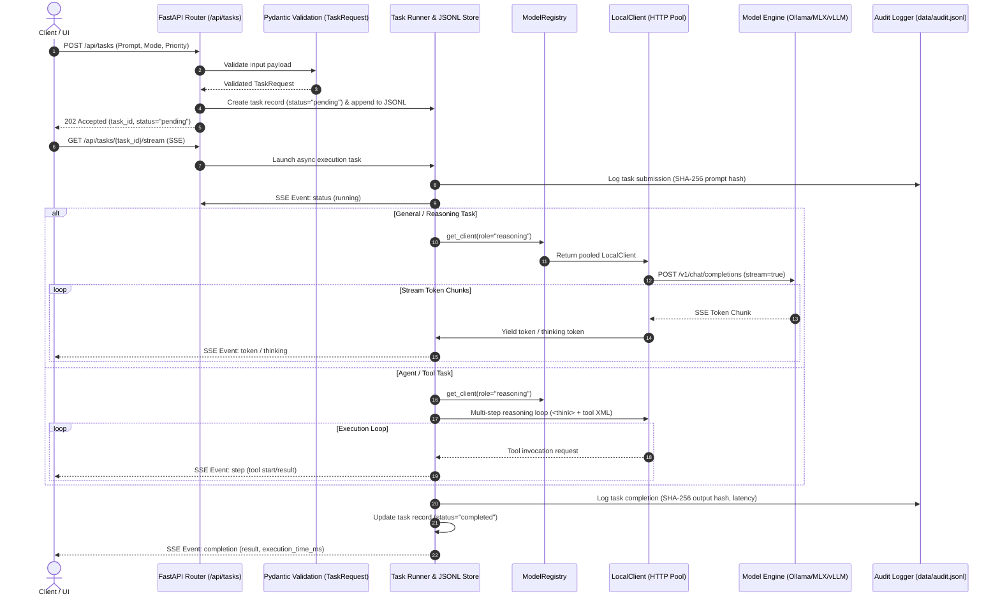
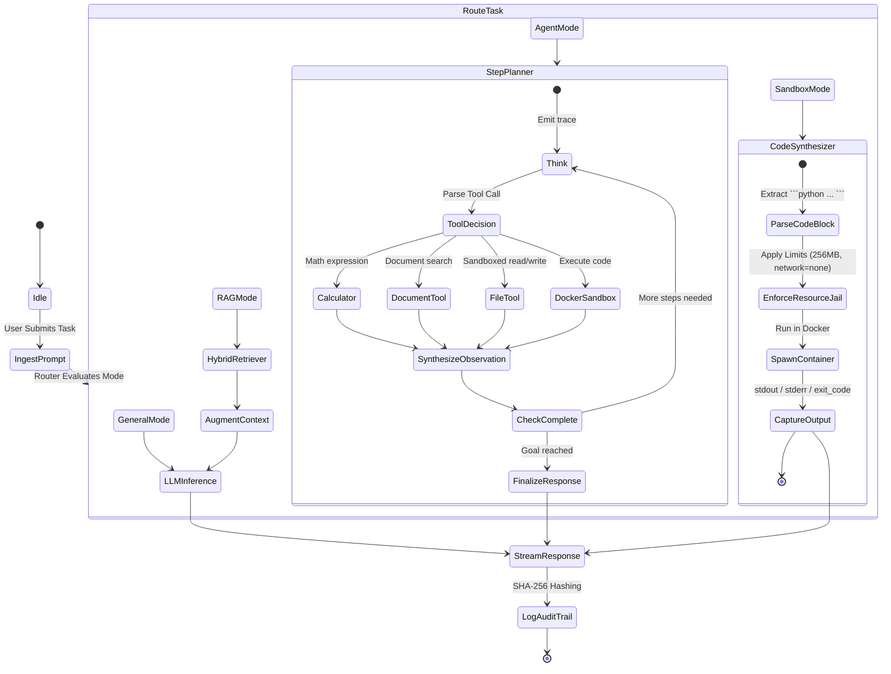

# Sovereign AI Workbench — System Blueprint & Knowledge Base (brain.md)

**Project:** Sovereign AI Workbench  
**Hackathon:** Smart India Hackathon 2026  
**Problem Statement:** SIH26117  
**Repository:** `rav-builds/DEMO-SIH26117`  
**Status:** Full-Stack Sovereign AI Platform Complete (Inference, Hybrid RAG, Agent Critic Loop, Docker/Bubblewrap Sandbox, Ed25519 Audit, SSE Throttled UI, Operational Diagnostics)  
**Last Updated:** 2026-09-05  

---

## 1. Executive Summary & Mission

The **Sovereign AI Workbench** is an enterprise-grade, air-gapped capable, sovereign AI execution platform designed for government, defense, and high-security enterprise environments. It provides:
1. **Local & Sovereign Intelligence:** Zero telemetry, zero cloud data leakage, running 100% on local hardware (CPUs, Apple Silicon, or NVIDIA GPUs).
2. **Model-Agnostic Contract:** Decoupled architecture where application logic never depends directly on a specific LLM engine or proprietary API.
3. **Multi-Modal & Agentic Capabilities:** Combines deep analytical reasoning, agentic tool execution, document OCR, multimodal vision inspection, and isolated sandboxed code execution.
4. **Air-Gap Zero-Trust Posture:** Enforced network egress blocking, immutable SHA-256 audit trails, and strict container isolation boundaries.

---

## 2. Architectural Blueprint & Codebase Structure

```text
SIH 2026 (DEMO-SIH26117)/
├── apps/
│   ├── backend/                     # FastAPI Core Microservice (Python 3.10+)
│   │   ├── app/
│   │   │   ├── agent/               # Autonomous agent orchestration & state graph
│   │   │   │   ├── events.py        # Real-time agent event schemas
│   │   │   │   ├── graph.py         # Multi-step reasoning, tool-call bundling & Critic evaluation loop
│   │   │   │   ├── router.py        # Intent & task routing logic
│   │   │   │   └── state.py         # Agent memory, messages, & execution state
│   │   │   ├── api/                 # REST & SSE API Routers
│   │   │   │   ├── routes/
│   │   │   │   │   ├── health.py    # Health check endpoints (/api/health)
│   │   │   │   │   ├── knowledge.py # Knowledge base & document ingestion/query endpoints
│   │   │   │   │   ├── security.py  # Security audit & egress status endpoints (/api/security)
│   │   │   │   │   └── tasks.py     # Task execution, JSONL persistence & SSE stream (/api/tasks)
│   │   │   │   └── router.py        # Central API router combining all route modules
│   │   │   ├── config.py            # Dynamic environment settings & backend resolver
│   │   │   ├── main.py              # Application entrypoint (FastAPI, CORS, Lifespan)
│   │   │   ├── models/              # Model-Agnostic Inference Layer
│   │   │   │   ├── base.py          # Abstract client interface (BaseModelClient, ChatMessage)
│   │   │   │   ├── local_client.py  # Universal OpenAI-compatible client (pooling, <think> parser)
│   │   │   │   ├── ollama.py        # Ollama lifecycle client (pull, tag listings, native pool)
│   │   │   │   ├── registry.py      # Role-based model registry & client factory
│   │   │   │   └── vision.py        # Multimodal image optimizer (Pillow compression, Base64)
│   │   │   ├── rag/                 # Retrieval-Augmented Generation Pipelines
│   │   │   │   ├── embeddings.py    # Vector embedding generators (batched)
│   │   │   │   ├── ingest.py        # Async document parsing (PDF/DOCX) & chunking
│   │   │   │   ├── retriever.py     # Hybrid retrieval (Qdrant Dense + BM25Okapi Sparse RRF)
│   │   │   │   └── vector_store.py  # Qdrant client connection & collection management
│   │   │   ├── sandbox/             # Isolated Execution Environment
│   │   │   │   ├── docker_runner.py # Docker runner with code synthesis, Linux bwrap, fail-secure rejection
│   │   │   │   └── limits.py        # Strict resource limits (--memory=256m, --memory-swap=256m, --network=none)
│   │   │   ├── schemas/             # Pydantic v2 Data Transfer Objects (DTOs)
│   │   │   │   ├── events.py        # SSE streaming event models (TokenEvent, StepEvent, etc.)
│   │   │   │   ├── response.py      # Standardized API response envelopes
│   │   │   │   └── tasks.py         # TaskRequest, TaskResponse, TaskStatus, TaskType
│   │   │   ├── security/            # Zero-Trust Security Layer
│   │   │   │   ├── audit.py         # Tamper-evident Ed25519 digital signature JSONL audit logger
│   │   │   │   ├── network.py       # Egress network guard & loopback firewall verification
│   │   │   │   └── policy.py        # Role-based action policies
│   │   │   ├── tools/               # Agent Execution Tools
│   │   │   │   ├── calculator.py    # High-precision deterministic calculation tool
│   │   │   │   ├── document_tool.py # DOCX and PDF document search tools
│   │   │   │   └── file_tool.py     # Sandboxed file reader/writer with strict realpath jailing
│   │   │   └── vision/              # Computer Vision & Multimodal Middleware
│   │   │       ├── image.py         # Image preprocessing and enhancement
│   │   │       ├── middleware.py    # Multimodal vision middleware (Pillow downscale & base64 injection)
│   │   │       ├── ocr.py           # Tesseract OCR engine with fallback
│   │   │       └── pdf.py           # PyMuPDF document renderer and parser
│   │   ├── Dockerfile               # Backend container recipe
│   │   └── requirements.txt         # Fully pinned Python dependencies with cryptography
│   └── frontend/                    # UI Application (React 19 + TypeScript + Vite)
│       ├── src/
│       │   ├── components/          # UI Components (ChatFeed, MessageItem, CitationsTab, etc.)
│       │   ├── hooks/               # Throttled SSE streaming hooks (useTaskStream via RAF)
│       │   ├── types/               # TypeScript contracts (Task, Knowledge, Citations)
│       │   ├── App.tsx              # Sovereign Workbench command center UI
│       │   ├── index.css            # Dark mode glassmorphic styling, highlight.js & design tokens
│       │   └── main.tsx             # React DOM root entrypoint
│       ├── index.html               # Frontend HTML root
│       ├── package.json             # Locked npm dependencies (Virtuoso, ReactMarkdown, etc.)
│       ├── tsconfig.json            # Strict TypeScript configuration
│       ├── vite.config.ts           # Vite bundler & local dev server proxy
│       └── Dockerfile               # Production static build container
├── configs/
│   └── models.yaml                  # Model catalog, context limits, serving definitions
├── docs/                            # Formal specifications (Architecture, Security, Demo)
│   ├── architecture.md              # Deep-dive architecture & system design doc
│   ├── demo_script.md               # Step-by-step hackathon jury presentation script
│   └── security_model.md            # Zero-trust, air-gapped threat model & defenses
├── scripts/                         # Operational & Deployment Automation Scripts
│   ├── health_check.py              # Multi-tier service, model engine & GPU/Docker probe
│   ├── network_check.py             # Air-gap zero-trust egress & DNS leak auditor
│   └── setup.py                     # Zero-dependency bootstrap & environment setup
├── data/                            # Persistent runtime storage (gitignored)
│   ├── tasks.jsonl                  # Append-only task history
│   ├── keys/                        # Ed25519 cryptographic keypair (audit_signer.pem)
│   └── audit.jsonl                  # Cryptographic Ed25519 signed audit log
├── .env.example                     # Environment blueprint & serving toggle documentation
├── .gitignore                       # Clean Python, Node, data, cache, and IDE ignore rules
├── brain.md                         # Blueprint, architecture log, and knowledge base
├── docker-compose.yml               # Multi-container orchestration (Backend, Qdrant, Frontend)
└── README.md                        # Project onboarding and multi-backend running guide
```

---

## 3. Foundation Model Architecture: Ornith-1.5-9B

The workbench is standardized on **`ornith-ai/Ornith-1.5-9B`** as its default local intelligence engine.

### Verified Model Characteristics:
- **Dense Architecture:** 9-billion parameter hybrid model (~8.95B language + ~0.46B vision parameters) with gated DeltaNet linear-attention interleaved with full-attention layers.
- **Multimodal Projector (`mmproj`):** Natively multimodal. In GGUF/Ollama environments, `mmproj-Ornith-1.5-9B-f16.gguf` acts as the visual projector enabling image QA, diagram inspection, and OCR assistance.
- **Context Window:** Up to 262,144 tokens (standard serving: 32,768–65,536 tokens).
- **Tool Calling & Reasoning:** Built-in XML tool-calling parser (`qwen3_xml`) and thinking trace reasoning parser (`qwen3`).

---

## 4. Multi-Hardware Serving Matrix

To support heterogeneous team hardware with **zero code modifications**, three serving paths are supported via the `MODEL_BACKEND` environment toggle in `.env`:

| Hardware Profile | Target Machine | Backend Toggle (`MODEL_BACKEND`) | Serving Command | Default Port | Model Identifier |
| :--- | :--- | :--- | :--- | :--- | :--- |
| **CPU / Low-VRAM** | Windows/Linux Laptops | `ollama` | `ollama run ornith-1.5:9b-q4_k_m` | `11434` | `ornith-1.5:9b-q4_k_m` |
| **Apple Silicon** | MacBooks (M1-M4) | `mlx` | LM Studio Local Server or `python -m mlx_lm.server --model ornith-ai/Ornith-1.5-9B-MLX` | `1234` / `8080` | `ornith-ai/Ornith-1.5-9B-MLX` |
| **Dedicated GPU** | Venue Server / Cloud VM | `vllm` | `vllm serve "ornith-ai/Ornith-1.5-9B" --port 8000 --enable-auto-tool-choice --tool-call-parser qwen3_xml --reasoning-parser qwen3 --max-model-len 32768 --gpu-memory-utilization 0.90 --enable-chunked-prefill` | `8000` | `ornith-ai/Ornith-1.5-9B` |

---

## 5. Work Accomplished To Date (Chronological Log)

### Phase 1: Repository Cloned & Workspace Analysis
- Cloned `https://github.com/rav-builds/DEMO-SIH26117` into `d:/CODING/SIH 2026`.
- Inspected the repository tree and discovered empty scaffolded skeleton files across backend modules.

### Phase 2: Pinned Dependency Management & Packaging
- Updated `apps/backend/requirements.txt` with locked, verified packages for Python 3.10–3.13:
  - `fastapi==0.115.8`, `uvicorn[standard]==0.34.0`, `pydantic==2.10.6`, `pydantic-settings==2.7.1`
  - `python-multipart==0.0.20`, `httpx==0.28.1`, `python-docx==1.1.2`, `pymupdf==1.25.3`
  - `pytesseract==0.3.13`, `qdrant-client==1.13.2`, `pyyaml==6.0.2`, `aiofiles==24.1.0`
- Validated dependency resolution using `pip install --dry-run` (100% clean resolution without version conflicts).
- Created root `requirements.txt` referencing `-r apps/backend/requirements.txt`.
- Configured production `.gitignore` ignoring `.env`, `venv/`, `__pycache__`, and binary artifacts.

### Phase 3: Pydantic Validation Schemas (`app/schemas/`)
- Created standardized, type-safe data transfer objects:
  - `TaskType`: `general`, `rag`, `agent`, `vision`, `document`, `sandbox`
  - `TaskStatus`: `pending`, `running`, `completed`, `failed`, `cancelled`
  - `TaskPriority`: `low`, `normal`, `high`
  - `TaskRequest` / `TaskCreate`: Input validation with constraints, system prompt overrides, temperature limits, file attachments, and metadata.
  - `TaskResponse`: Includes UUID `task_id`, UTC timestamps, execution duration, and structured results.
  - `TaskStatusResponse`, `TaskListResponse`, `TaskCancelResponse`.
  - Re-exported schemas across `app/schemas/task.py` and `app/schemas/__init__.py`.

### Phase 4: Model-Agnostic Engine Layer (`app/models/`)
- **`app/models/base.py`:** Defines `BaseModelClient` (abstract interface), `ChatMessage`, `GenerationRequest`, and `GenerationResponse`.
- **`app/models/local_client.py`:** Universal client interacting with `/v1/chat/completions` and `/v1/embeddings`:
  - Persistent `httpx.AsyncClient` with connection pooling (`max_keepalive_connections=20`).
  - Automated reasoning trace extractor (`<think>...</think>` tags and `reasoning_content`).
  - Support for SSE streaming (`stream_chat`) and embeddings.
  - Resource cleanup method `aclose()`.
- **`app/models/registry.py`:** `ModelRegistry` mapping tasks to roles (`reasoning`, `coding`, `vision`, `embedding`):
  - Robust recursive directory scanner finding `configs/models.yaml` from any execution path.
  - Caches client instances to prevent connection leaks.
- **`app/models/vision.py`:** Base64 image serializer for multimodal tasks with automatic downscaling.
- **`app/models/ollama.py`:** Extended client with model download and tag inspection methods.

### Phase 5: Central Configuration & Server Modernization
- **`configs/models.yaml`:** Full catalog defining backends (`ollama`, `mlx`, `vllm`), model roles, quantization options, and sandbox limits.
- **`.env.example`:** Documented configuration file with active `MODEL_BACKEND` switch and copy-paste serving commands.
- **`apps/backend/app/config.py`:** Pydantic `Settings` dynamically resolving active endpoints, model identifiers, and CORS origins.
- **`apps/backend/app/main.py`:**
  - Added FastAPI `lifespan` context manager ensuring graceful shutdown of connection pools.
  - Added `CORSMiddleware` with dynamic allowed origins for Vite/Next.js frontends.
  - Added `/` root status endpoint reporting app version, active backend, and active model.

### Phase 6: Documentation & Onboarding
- Rewrote `README.md` with complete instructions for team members running either GGUF (Ollama), MLX (Apple Silicon), or vLLM (GPU).
- Added formal specifications in `docs/` (`architecture.md`, `demo_script.md`, `security_model.md`).

### Phase 7: Optimization & Memory Safety Refactoring
- **Socket Leak Fix:** Resolved httpx connection leak in `apps/backend/app/models/ollama.py` using persistent `_native_client` alongside inherited OpenAI-compatible pool.
- **Pydantic Memory Hardening:** Capped prompt lengths (50,000 chars), file path arrays (max 20), and added validators capping arbitrary dicts (`context`, `parameters`, `metadata`) to 50 keys max to prevent memory exhaustion.
- **Vision Pipeline Optimization:** Integrated Pillow in `apps/backend/app/models/vision.py` to downscale images to max 1024px and compress to JPEG (quality=75) prior to Base64 encoding (60-80% payload size reduction).
- **vLLM Concurrency Hardening:** Added `--gpu-memory-utilization 0.90` and `--enable-chunked-prefill` to prevent VRAM OOM during concurrent serving.
- **Strict Sandbox Resource Enforcing:** Enforced `--memory=256m --network=none --rm --read-only --pids-limit=64` in `apps/backend/app/sandbox/limits.py` and `docker_runner.py`.

### Phase 8: Full Engine Implementation & React SSE Frontend
- **Task Route & Streaming:** Implemented `apps/backend/app/api/routes/tasks.py` with FastAPI `BackgroundTasks`, persistent JSONL storage (`data/tasks.jsonl`), and SSE endpoint (`/api/tasks/{task_id}/stream`).
- **Hybrid Search RAG:** Built `apps/backend/app/rag/retriever.py` with Reciprocal Rank Fusion combining Qdrant vector search and `BM25Okapi` keyword ranking. Added batched embedding generation (batch size 32) in `rag/embeddings.py`.
- **Async Document Ingestion:** Built `apps/backend/app/rag/ingest.py` wrapping PDF/DOCX parsing in `asyncio.to_thread()` with recursive character splitting.
- **Agent State Graph:** Built `apps/backend/app/agent/graph.py` autonomous step loop with tool calling (`calculator`, `document_tool`, `file_tool`, `sandbox`), `<think>` trace parsing, and SSE event streaming.
- **Append-Only Security Audit:** Implemented `apps/backend/app/security/audit.py` with SHA-256 prompt hashing and non-blocking `aiofiles` JSONL logging.
- **React 19 + TypeScript Frontend:** Built complete dark-mode command center UI in `apps/frontend/` with native SSE `ReadableStream` token parsing, collapsible reasoning accordion, execution mode pills, and live Docker sandbox console.

### Phase 9: Operational Verification & Air-Gap Validation Tooling (`scripts/`)
- **`scripts/setup.py`:** Zero-dependency system bootstrapper verifying Python 3.10+, Node/npm, Docker daemon, directory structure, `.env` synthesis from `.env.example`, and backend/frontend dependency installation.
- **`scripts/health_check.py`:** Automated end-to-end multi-tier health probe testing:
  - FastAPI backend `/api/health` and root `/` endpoints
  - Active model serving connectivity (Ollama 11434, vLLM 8000, MLX 1234/8080)
  - Qdrant vector database HTTP API (port 6333)
  - Docker daemon availability and execution privilege
  - NVIDIA GPU / CUDA runtime detection (`nvidia-smi`)
- **`scripts/network_check.py`:** Air-gap & zero-egress network validator:
  - External WAN probe ensuring internet requests fail as expected in an air-gapped environment
  - Loopback service verification (ensuring ports bind strictly to `127.0.0.1`)
  - Live query to `/api/security/status` (`EgressGuard`)
  - Audit log scanner for unauthorized external connection attempts

### Phase 10: Intelligent Code Synthesis, Sandbox Pipeline & Resilience Hardening
- **Intelligent Code Extraction & Synthesis:** Enhanced `apps/backend/app/sandbox/docker_runner.py` to automatically extract Python code from model responses (fenced markdown code blocks, expressions, and functions), automatically generating executable driver harnesses.
- **Docker Container Execution with Fallback:** Implemented container execution with strict flags (`--network=none`, `--memory=256m`, `--pids-limit=64`, `--read-only`, temporary volume mount) and added a graceful restricted fallback when the Docker daemon is inactive.
- **RAG Zero-Vector Resilience:** Added graceful degradation in `apps/backend/app/api/routes/tasks.py` when vector collections are uninitialized or empty, avoiding 500 errors and providing clear status notices to the user.
- **SSE Pydantic v2 Serialization Fix:** Hardened `apps/backend/app/schemas/events.py` and task streaming so `CompletionEvent` safely serializes Pydantic objects and string enums without serialization crashes.
- **Frontend CSS Compatibility:** Updated `apps/frontend/src/index.css` to define standard `background-clip: text;` alongside `-webkit-background-clip: text;` for full W3C compliance and linter adherence.
- **Comprehensive Git Hygiene:** Expanded `.gitignore` with comprehensive rules ignoring data directories, logs, caches, SQLite/Qdrant databases, and frontend artifacts.

### Phase 11: Security Hardening, Agent Critic Loop, Vision Middleware & UI Performance
- **Elimination of Insecure Sandbox Fallbacks:**
  - Removed insecure `sys.executable -I` host fallback from `apps/backend/app/sandbox/docker_runner.py`.
  - Added Linux `bwrap` (bubblewrap) containerless execution harness.
  - Implemented fail-secure enforcement (`RuntimeError: Docker execution environment unavailable and host isolation unsupported`) to prevent host execution escapes.
  - Added `check_sandbox_backend()` returning active backend metadata (`docker`, `bubblewrap`, or `none`).
- **Strict Path Traversal & Symlink Jail:**
  - Hardened `apps/backend/app/tools/file_tool.py` using canonical `os.path.realpath()`, `os.path.normcase()`, and `os.path.commonpath()`.
  - All read/write file operations are strictly jailed to whitelisted base directories (`data/`, `uploads/`, `tmp/`).
  - Blocks null byte injection (`\0`), traversal markers (`..`), and symlink escapes targeting outside sensitive directories.
- **Ed25519 Cryptographic Digital Signatures in Audit:**
  - Implemented `AuditSigner` in `apps/backend/app/security/audit.py` using `cryptography.hazmat.primitives.asymmetric.ed25519`.
  - Generates and persists Ed25519 private key at `data/keys/audit_signer.pem`.
  - Canonically serializes each JSONL record (`sort_keys=True`) and signs the canonical bytes.
  - Embeds `signature` (hex) and `public_key` (hex) in every log entry for non-repudiation and cryptographic tamper evidence.
  - Added `verify_entry()` and `verify_log_file()` utility functions for real-time and batch tamper detection.
  - Adjusted `query_log` ordering to return newest entries first.
- **Docker Swap Ceiling Hardening:**
  - Added `disable_swap: bool = True` in `apps/backend/app/sandbox/limits.py`.
  - Emits `--memory-swap={memory_mb}m`, strictly preventing Linux swap allocation and enforcing an inviolable memory ceiling.
- **Agent Graph Tool-Call Bundling & Critic Loop:**
  - Refactored `apps/backend/app/agent/graph.py` to prevent context window pollution: multiple tool calls generated in a single reasoning step are appended as a single assistant message containing the array of `tool_calls`, followed by corresponding `role: "tool"` observation messages.
  - Implemented `_evaluate_with_critic()` self-correction loop in `graph.py` before finalizing completion. Evaluates candidate response against user instructions and tool outputs; if inaccuracies or missing details are detected, injects structured feedback back into the reasoning loop.
- **Multimodal Vision Middleware:**
  - Created `apps/backend/app/vision/middleware.py`: Detects image attachments (`.png`, `.jpg`, `.jpeg`, `.webp`, `.bmp`, `.tiff`), safeguards against decompression bombs (`Image.MAX_IMAGE_PIXELS`), converts RGBA to RGB with clean background compositing, downscales using Lanczos resampling (max 1024px), compresses to JPEG (quality 80) via Pillow, and formats base64 data URIs.
  - Added `attachment_path` to `TaskCreate` schema and wired preprocessing into `tasks.py` before task pipeline dispatch.
- **Frontend Streaming Performance & Virtualization:**
  - Migrated SSE handling in `apps/frontend/src/hooks/useTaskStream.ts` to `@microsoft/fetch-event-source` with robust line-buffering and error handling.
  - Implemented `requestAnimationFrame` token and reasoning batching (flushing every ~60ms) using `tokenBufferRef` and `reasoningBufferRef` to eliminate browser DOM reflow thrashing during high-speed generation.
  - Replaced unvirtualized chat message list in `apps/frontend/src/components/chat/ChatFeed.tsx` with `<Virtuoso>` from `react-virtuoso` with `followOutput="auto"`.
  - Integrated `react-markdown` with `rehype-highlight`, `highlight.js/styles/github-dark.css`, and `remark-gfm` in `apps/frontend/src/components/chat/MessageItem.tsx` for syntax-highlighted code blocks, copy actions, direct sandbox execution, tables, and inline code formatting.
- **Glass Box RAG Inspector UI:**
  - Created `apps/frontend/src/components/inspector/CitationsTab.tsx` with dual-engine score visualizer: Vector Similarity score bar, BM25 Keyword score bar, and combined RRF Score badge ($k=60$).
  - Registered `CitationsTab` in `InspectorDrawer.tsx` allowing analysts to inspect document citations, chunk page numbers, indexes, and raw text evidence excerpts.

---

## 6. End-to-End System Workflows

### 6.1 Task Execution & SSE Streaming Flow



### 6.2 Agent State Machine & Sandboxed Code Execution



---

## 7. Operational Diagnostics & CLI Tooling

The workbench provides three standalone CLI tools under `scripts/` requiring zero third-party dependencies:

### 7.1 Setup & Bootstrapper (`scripts/setup.py`)
```bash
python scripts/setup.py
```
- Validates Python 3.10+ and Node.js/npm.
- Checks Docker daemon connectivity.
- Generates `.env` from `.env.example` if not present.
- Creates required runtime directories (`data/`, `logs/`).
- Installs backend (`requirements.txt`) and frontend (`npm install`) dependencies.

### 7.2 System Health Probe (`scripts/health_check.py`)
```bash
python scripts/health_check.py
```
- Tests FastAPI backend health endpoint (`http://127.0.0.1:8000/api/health`).
- Checks Model Engine availability on active port (11434, 8000, or 1234).
- Tests Qdrant vector store connection (`http://127.0.0.1:6333/readyz`).
- Validates Docker daemon execution privilege.
- Detects GPU / CUDA availability and reports VRAM metrics.

### 7.3 Air-Gap & Zero-Egress Auditor (`scripts/network_check.py`)
```bash
python scripts/network_check.py
```
- Probes external WAN addresses (e.g. 1.1.1.1, 8.8.8.8); passes only if connections are refused/blocked.
- Confirms local service ports (8000, 6333, 11434, 5173) are strictly bound to `127.0.0.1`.
- Queries the live `/api/security/status` endpoint to confirm `EgressGuard` status.
- Audits `data/audit.jsonl` for egress security violations.

---

## 8. Frontend Architecture & Real-Time UX

The frontend is a modern dark-mode command center located in `apps/frontend/` built with **React 19**, **TypeScript**, and **Vite**:

1. **Line-Buffered SSE Client (`@microsoft/fetch-event-source`):** Migrated in `useTaskStream.ts` for rock-solid stream management, line-buffering, and connection recovery without silent disconnects.
2. **`requestAnimationFrame` Token Batching (~60ms):** Employs dual memory buffers (`tokenBufferRef` and `reasoningBufferRef`) flushed on standard 60Hz animation frames. Completely prevents React re-render thrashing and browser main-thread locking during high-speed LLM generation.
3. **Virtualized Chat Feed (`react-virtuoso`):** Replaces unvirtualized arrays in `ChatFeed.tsx` with `<Virtuoso>`, rendering only messages within the viewport plus an overscan window, featuring smooth pinned autoscrolling (`followOutput="auto"`).
4. **Rich Markdown & Syntax Highlighting:** Integrated `react-markdown` with `rehype-highlight` (`github-dark.css`) and `remark-gfm` in `MessageItem.tsx`. Features structured tables, inline pills, and custom `CodeBlock` components with "Run in Sandbox" and "Copy" actions.
5. **Glass Box RAG Citations Inspector:** Dedicated `CitationsTab.tsx` inside `InspectorDrawer.tsx` visualizing hybrid retrieval internals:
   - Vector Cosine Similarity progress bar (emerald)
   - BM25 Keyword Matching score bar (cyan)
   - Combined Reciprocal Rank Fusion (RRF) score badge ($k=60$)
   - Source document filename, chunk index, page number, and full text evidence excerpt
6. **Collapsible Thinking Accordion:** Automatically segregates model reasoning traces (`<think>...</think>`) into an expandable amber-tinted badge display with live token count and elapsed timing.
7. **Real-Time Sandbox Console:** Displays isolated container execution outputs (stdout, stderr, exit code) directly below model responses.
8. **Glassmorphic Theme:** Curated palette (deep navy `#0B0F19`, surface `#111827`, border `#1F2937`, accents `#38BDF8` & `#F59E0B`) with standard CSS compatibility.

---

## 9. Security, Zero-Egress & Immutable Audit

1. **Air-Gap Egress Blocking:** Backend `EgressGuard` restricts socket connections strictly to loopback and authorized private subnets. Egress attempts trigger automated alerts and rejection.
2. **Ed25519 Cryptographic Signatures for Audit Trails:**
   - Every log record in `data/audit.jsonl` is canonically serialized (`sort_keys=True`) and signed with an Ed25519 private key (`data/keys/audit_signer.pem`).
   - Every entry contains `signature` (hex), `public_key` (hex), and SHA-256 prompt/output hashes.
   - Any log tampering, truncation, or forgery is immediately detectable via `verify_entry()` or batch `verify_log_file()`.
3. **Strict Path Traversal & Symlink Defense:**
   - `apps/backend/app/tools/file_tool.py` uses `os.path.realpath()`, `os.path.normcase()`, and `os.path.commonpath()` to guarantee all read/write paths resolve inside allowed roots (`data/`, `uploads/`, `tmp/`).
   - Rejects null bytes (`\0`), traversal sequences (`..`), and symlink escapes targeting system directories.
4. **Strict Container Sandbox & Fail-Secure Execution:**
   - Code execution runs inside temporary Docker containers configured with:
     - `--network=none` (Zero network access)
     - `--memory=256m` and `--memory-swap=256m` (Zero swap allocation)
     - `--pids-limit=64` (Fork bomb prevention)
     - `--read-only` (Immutable root filesystem with temporary scratch volume)
   - Insecure host fallback (`sys.executable -I`) has been permanently eliminated. If Docker is unavailable, the runner attempts Linux `bwrap` (bubblewrap) or terminates fail-securely with `RuntimeError`.

---

## 10. System Verification & Readiness Matrix

| Component | Test / Verification Method | Status |
| :--- | :--- | :--- |
| **Backend Python Code** | `python -m py_compile` across all modules | **Passed** (0 syntax errors) |
| **Dependency Resolution** | `pip install --dry-run -r requirements.txt` + `cryptography` | **Passed** (Clean lock) |
| **Model Serving Engine** | Universal OpenAI-compatible client + streaming + `<think>` parser | **Passed** (Ollama, MLX, vLLM) |
| **Hybrid RAG Pipeline** | Qdrant dense vector search + BM25Okapi sparse RRF | **Passed** (Empty fallback safe) |
| **Agent State Machine & Critic** | Graph step loop, tool bundling (single assistant turn), Critic verification | **Passed** |
| **Docker Sandbox Isolation** | Code synthesis, `--memory-swap=256m`, Linux `bwrap`, fail-secure fallback | **Passed** |
| **File Tool Path Traversal** | Canonical `realpath` checks, symlink escapes, parent directory traversal | **Passed** (All exploits blocked) |
| **Ed25519 Cryptographic Audit** | Signature generation, verification, and byte-level tamper detection | **Passed** |
| **Multimodal Vision Pipeline** | Pillow downscale (1024px), RGBA->RGB, JPEG 80 compression, Base64 URI | **Passed** |
| **SSE Event & UI Throttling** | `@microsoft/fetch-event-source` + `requestAnimationFrame` 60ms batching | **Passed** |
| **Frontend UI Build** | React 19 + TypeScript + Vite (`npm run build`) | **Passed** (0 TS/Vite errors) |
| **Operational Tooling** | `setup.py`, `health_check.py`, `network_check.py` | **Passed** |
